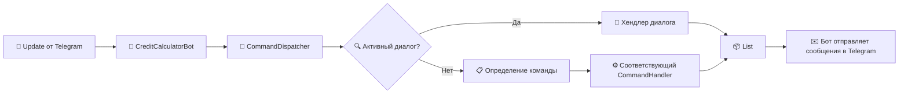

# 💰 Credit Calculator Bot

Telegram-бот для расчёта графиков кредитных платежей (аннуитетных и дифференцированных). Поддерживает историю запросов, аналитику для авторизованных менеджеров, асинхронную обработку сообщений и разбивку длинных ответов на несколько сообщений.

---

## 📌 Функциональность

- **Расчёт графика платежей** (`/calculate`) – аннуитетный или дифференцированный, на основе суммы, срока (мес.) и годовой ставки.
- **История расчётов** (`/history`) – каждый запрос сохраняется с привязкой к пользователю.
- **Статистика (только для менеджеров)**:
    - `/stats` – общая информация: количество расчётов по типам, общая сумма кредитов.
    - `/types` – статистика по типам платежей.
    - `/range <min> <max>` – поиск запросов в диапазоне сумм.
    - `/total` – общая сумма всех кредитов.
- **Авторизация** – доступ к статистике через команду `/admin` и ввод пароля (пароль один для всех менеджеров).
- **Умная отправка** – длинные графики платежей разбиваются на части (по 24 месяца) из-за лимита Telegram (4096 символов).
- **Асинхронность** – все команды обрабатываются в пуле потоков, бот не «зависает» при медленных операциях.

---

## 🧱 Архитектура проекта

### Основные компоненты

| Компонент                                    | Описание                                                                                                                                              |
|----------------------------------------------|-------------------------------------------------------------------------------------------------------------------------------------------------------|
| `CreditBot`                                  | Главный класс, наследник `TelegramLongPollingBot`. Принимает обновления, отправляет индикатор `typing` и передаёт сообщения в диспетчер.              |
| `CommandDispatcher`                          | Маршрутизирует входящие сообщения: либо на активный диалог (например, ввод суммы/пароля), либо на соответствующий `CommandHandler` по тексту команды. |
| `CommandHandler` (интерфейс)                 | Все хендлеры реализуют метод `handle(Update)`, возвращающий `List<SendMessage>`.                                                                      |
| **Хендлеры**                                 |                                                                                                                                                       |
| `StartCommandHandler`                        | Приветственное меню (разное для обычных и авторизованных пользователей).                                                                              |
| `CalculateCommandHandler`                    | Диалог для ввода параметров кредита, расчёт графика платежей, разбивка на несколько сообщений.                                                        |
| `HistoryCommandHandler`                      | Показывает все сохранённые расчёты пользователя.                                                                                                      |
| `AdminCommandHandler`                        | Запрашивает пароль, выполняет авторизацию, устанавливает флаг `isAuthorized`.                                                                         |
| `ManagerStatsCommandHandler`                 | Обрабатывает команды статистики (проверяет авторизацию, иначе отклоняет).                                                                             |
| **Сервисы**                                  |                                                                                                                                                       |
| `CreditService`                              | Методы расчёта платежей, сохранения запросов, получения агрегированной статистики.                                                                    |
| `AuthService`                                | Управление авторизованными пользователями (в памяти или с привязкой к БД).                                                                            |
| **Модели**                                   |                                                                                                                                                       |
| `Payment` (record)                           | Один платёж: номер, общий платёж, основной долг, проценты, остаток.                                                                                   |
| `CreditRequest` (record)                     | Сохранённый запрос: сумма, срок, ставка, тип платежа, ID пользователя, дата.                                                                          |
| **Вспомогательные**                          |                                                                                                                                                       |
| `PaymentScheduleCalculator` (интерфейс)      | Стратегия для расчёта графика. Реализации: `AnnuityScheduleCalculator`, `DifferentiatedScheduleCalculator`.                                           |
| `PaymentScheduleCalculatorFactory` (фабрика) | Создаёт нужный вариант калькулятора в зависимости от типа расчёта.                                                                                    |

### Схема взаимодействия



## 🚀 Запуск проекта

### 1. Предварительные требования

- **Java 17** или выше
- **Gradle** (если не используется обёртка `./gradlew`)
- **Токен бота** от [@BotFather](https://t.me/BotFather)

### 2. Получение токена

1. Напишите [@BotFather](https://t.me/BotFather) команду `/newbot`
2. Придумайте имя и username бота (должен заканчиваться на `...bot`)
3. Скопируйте полученный **токен** (например, `123456:ABC-DEF1234ghIkl-zyx57W2v1u123ew11`)

### 3. Конфигурация

Создайте файл `application.properties` в папке `src/main/resources/` со следующим содержимым:

```properties
bot.token=ВАШ_ТОКЕН_СЮДА
bot.username=username_вашего_бота
admin.password=секретный_пароль
```
### Пояснение параметров (файл `application.properties`)

| Параметр | Описание |
|----------|----------|
| `bot.token` | Токен вашего бота, полученный от BotFather |
| `bot.username` | Username бота (без `@`), например `my_credit_bot` |
| `admin.password` | Пароль для доступа к командам статистики (можно любой строкой) |

### Сборка и запуск

**Способ А: через Gradle (рекомендуется)**

```bash
# Linux / macOS
./gradlew clean build

# Windows
gradlew.bat clean build
```
Затем запустите JAR-файл:

```bash
java -jar build/libs/credit-bot-1.0.0.jar
```
**Способ Б: через IDE (IntelliJ IDEA, Eclipse)**

- Откройте проект как Gradle-проект
- Найдите основной класс `App` 
- Запустите его

### Проверка работы

1. Откройте Telegram, найдите бота по его `username` (например, `@my_credit_bot`)
2. Отправьте `/start` – бот должен ответить приветствием
3. Попробуйте `/calculate` и введите параметры кредита
4. Для доступа к статистике отправьте `/admin` и введите пароль, указанный в `admin.password`

> **Примечание:** Если бот не отвечает, проверьте подключение к интернету (и возможность подключения к телеграмму) и правильность токена в конфигурации.

### Устранение возможных проблем

| Проблема                        | Решение |
|---------------------------------|---------|
| `java.lang.NoClassDefFoundError` | Проверьте, что все зависимости загружены (`./gradlew build` должен завершаться без ошибок) |
| Бот не отвечает на команды      | Убедитесь, что токен верен, и бот не запущен в другом месте (сессия Telegram ограничена) |
| Ошибка «`Chat not found`»         | Пользователь не начал диалог с ботом (не отправил `/start`) |
| Индикатор печати не появляется  | Это нормально для быстрых операций (менее 2 секунд). Для долгих команд индикатор будет заметен |